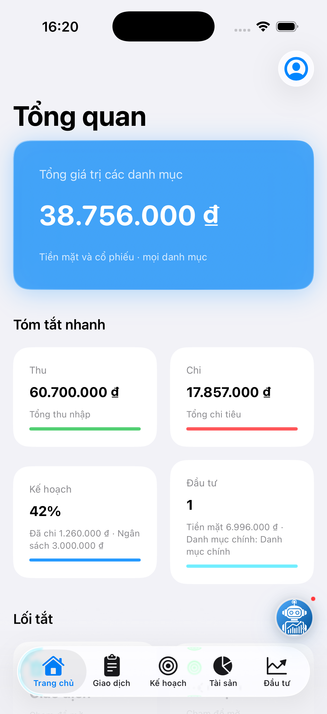
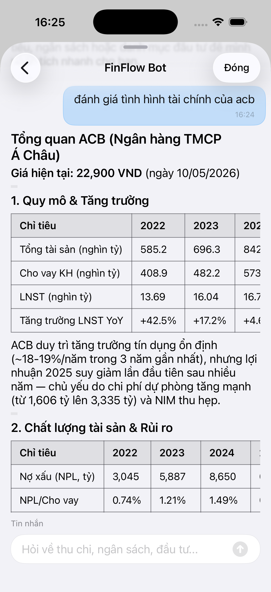
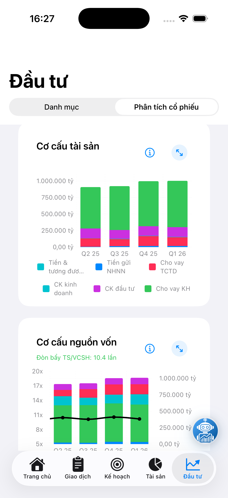
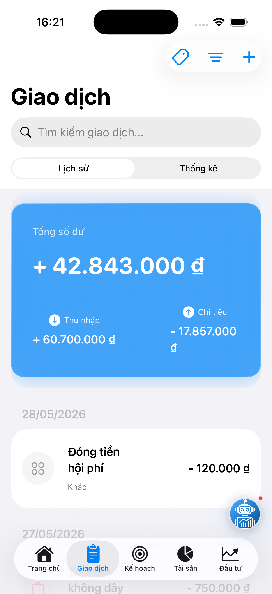
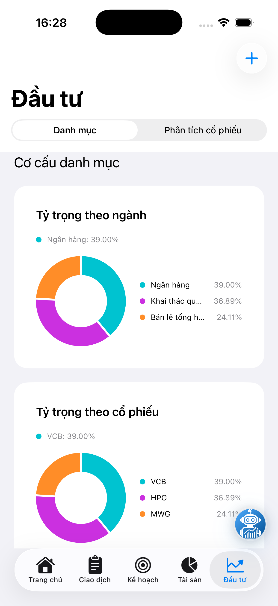
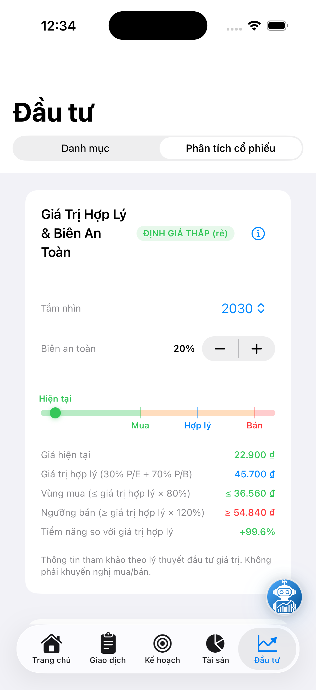
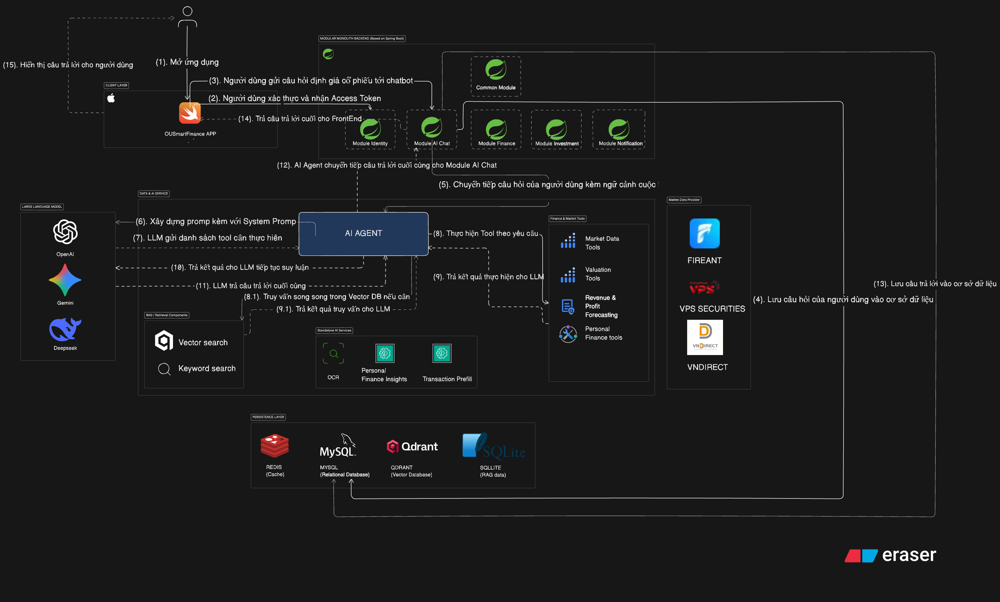

# FinFlow — AI Personal Finance & Vietnamese Stock Analysis

> Full-stack iOS, Spring Boot, and FastAPI platform for personal finance, portfolio tracking, AI stock analysis, Hybrid RAG over annual reports, deterministic valuation, and XGBoost financial forecasting.

[](https://swift.org)
[](https://www.apple.com/ios)
[](https://spring.io/projects/spring-boot)
[](https://openjdk.org)
[](https://fastapi.tiangolo.com)
[](https://www.python.org)
[](LICENSE)

FinFlow was built as a production-style project for Vietnamese users who want to manage daily finances and analyze listed companies in one app. The system connects a native iOS client, a modular Spring Boot backend, and a Python AI service that can retrieve annual-report context, forecast financials, and explain stock valuation results.

## Project Links

| Repository | Purpose | Stack |
|------------|---------|-------|
| [FinFlowFE_v2](https://github.com/nguyenvanbao1904/FinFlowFE_v2) | Native iOS app | Swift 6.2, SwiftUI, Swift Charts |
| [FinFlowBE_v2](https://github.com/nguyenvanbao1904/FinFlowBE_v2) | API backend | Java 25, Spring Boot 4, MySQL, Redis |
| [FinFlowDataAiService_V2](https://github.com/nguyenvanbao1904/FinFlowDataAiService_V2) | AI and ML service | Python 3.12, FastAPI, DeepSeek, Voyage AI, XGBoost |

## What I Built

- Designed the end-to-end architecture across iOS, backend, and AI service.
- Implemented personal finance, wealth account, investment portfolio, market data, and AI chat flows.
- Built a Hybrid RAG pipeline for Vietnamese annual reports using Voyage embeddings, Qdrant, SQLite FTS/BM25, RRF fusion, Voyage reranking, OCR fallback, and traceable retrieval metadata.
- Built an XGBoost forecasting pipeline for revenue and profit after tax using MySQL financial statements, macro variables, sector-aware interactions, RFE feature selection, recency weighting, and walk-forward evaluation.
- Integrated FireAnt financial data and Vietstock annual-report ingestion into repeatable, incremental pipelines.
- Implemented a deterministic valuation engine that routes companies to finance-appropriate methods such as P/B + P/E for banks, dividend discount for high-dividend stocks, normalized earnings for cyclicals, and book-value references for asset-heavy cases.

## Highlights

- **Personal finance:** transaction tracking, budgets, OCR receipt input, wealth accounts, and AI spending insights.
- **Vietnam stock analysis:** 1,500+ HOSE/HNX/UPCOM tickers, financial statements, ratios, shareholders, dividends, charts, peer comparison, and fair value tools.
- **AI assistant:** ReAct-style tool calling with DeepSeek, backend financial tools, forecast tools, annual-report RAG, deterministic valuation tools, chat traces, and usage limits.
- **Hybrid RAG:** semantic search + keyword search + reciprocal rank fusion + reranking, indexed into Qdrant with about 130k annual-report chunks.
- **ML forecasting:** Bank and Non-Bank XGBoost models for next-year revenue and profit after tax.

## Screenshots

<p align="center">
  
  
  
</p>

<p align="center">
  
  
  
</p>

## Results

**Hybrid RAG evaluation, 50-question RAGAS run**

| Metric | Score |
|--------|------:|
| Faithfulness | 0.877 |
| Answer relevancy | 0.817 |
| Context precision | 0.908 |
| Context recall | 0.980 |

**XGBoost walk-forward forecasting**

| Scope | Revenue R² / WAPE | Profit R² / WAPE |
|-------|-------------------|------------------|
| VN30 | 0.9001 / 15.31% | 0.7844 / 22.71% |
| VN100 | 0.9296 / 16.52% | 0.8582 / 27.85% |
| All Market | 0.9411 / 18.24% | 0.8647 / 34.87% |

## Architecture

<p align="center">
  
</p>

The backend follows a modular-monolith style with clear module boundaries for identity, finance, wealth, investment, portfolio, notification, and AI chat. The iOS app uses feature packages and SwiftUI presentation layers. The AI service owns LLM orchestration, RAG retrieval, forecast inference, and evaluation tooling.

## Tech Stack

| Layer | Technologies |
|-------|--------------|
| iOS | Swift 6.2, SwiftUI, Swift Concurrency, Swift Charts, SPM |
| Backend | Java 25, Spring Boot 4, Spring Security, JWT, MySQL, Redis, Flyway, Maven |
| AI Service | Python 3.12, FastAPI, pydantic-ai, DeepSeek, Voyage AI, Qdrant, SQLite FTS, XGBoost, scikit-learn |
| Data | FireAnt market/financial data, Vietstock annual reports, OCR fallback for scanned PDFs |

## Run Locally

Each source repository has its own setup guide. The short version:

```bash
# Backend
cd backend
./mvnw spring-boot:run

# AI service
cd data_ai_service
uvicorn app.main:app --reload --port 8001

# iOS app
cd FinFlow_Project/FinFlowIos
open FinFlow.xcodeproj
```

## Why This Project Matters

FinFlow demonstrates the work expected in a real financial product: clean client architecture, secure backend APIs, data ingestion, AI tool orchestration, grounded retrieval, model evaluation, and user-facing investment workflows. It is intentionally more than a CRUD app: the hard parts are data quality, explainable AI answers, financial forecasting, deterministic valuation, and keeping the UX simple enough for real users.

## Contact

**Developer:** Nguyễn Văn Bảo  
**GitHub:** [@nguyenvanbao1904](https://github.com/nguyenvanbao1904)

## License

This project is licensed under the **MIT License**.
